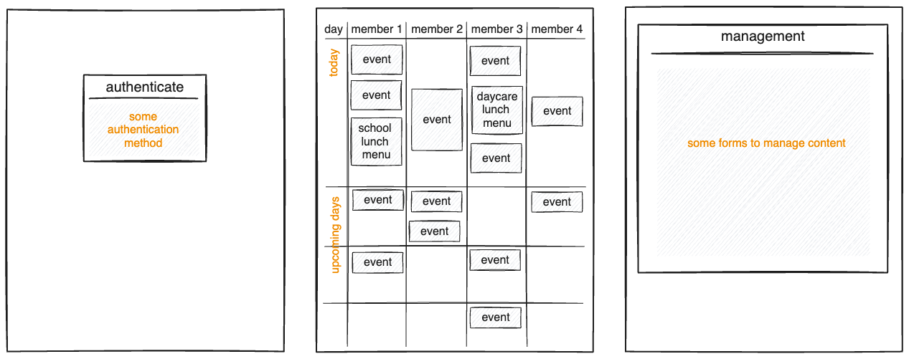

# FamilyCalendar

[](https://github.com/juhenius/family-calendar/actions/workflows/deployment-pipeline.yml)

This document outlines the FamilyCalendar project, an open-source shared digital calendar for family use, targeted to support children in better understanding the progression of their day.

## Motivation

The project aims to:

- Create a child-friendly, digital family calendar
- Eliminate the need for maintaining paper-based calendars
- Provide automatic syncing between digital devices
- Integrate external data sources such as school lunch menus and weather forecasts
- Learn some AWS basics
- Learn some HTMX basics

## Guestimated Result of the First Iteration



The first iteration aims to potentially deliver:

- Some authentication system
- Calendar view suitable for touch screen interaction
- Management interface accessible via mobile devices
- Some form of deployment pipeline

## Setup Instructions

To install necessary tools for the FamilyCalendar setup, run the following commands:

```bash
# aws cli
brew install awscli
aws configure

# dotnet aws tool
dotnet tool install -g Amazon.Lambda.Tools
```

## Run locally

To run locally while still utilizing AWS services such as DynamoDB

```bash
dotnet run

# or with watch
dotnet watch run
```

## Deployment

To deploy the application to AWS, execute:

```bash
dotnet lambda deploy-serverless
```

## Contribution and Support

Contributions to the project are welcome. For support or to report issues, please refer to the project's issues page on GitHub.

## Resources

- [Icons](https://www.untitledui.com/free-icons)

## Author

Jari Helenius

[![LinkedIn][linkedin-shield]][linkedin-url]

<!-- MARKDOWN LINKS & IMAGES -->

[linkedin-shield]: https://img.shields.io/badge/-LinkedIn-black.svg?style=for-the-badge&logo=linkedin&colorB=555
[linkedin-url]: https://linkedin.com/in/jari-helenius-a445478a
